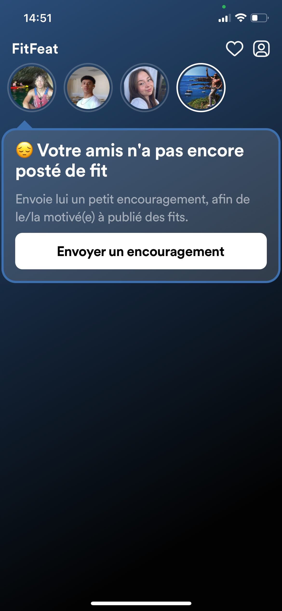
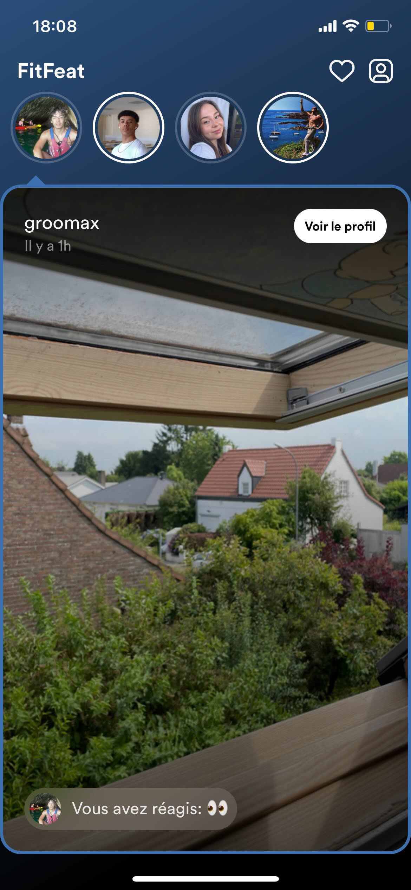
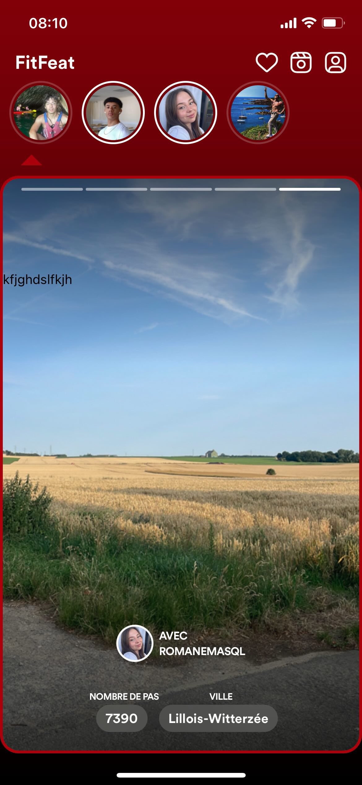
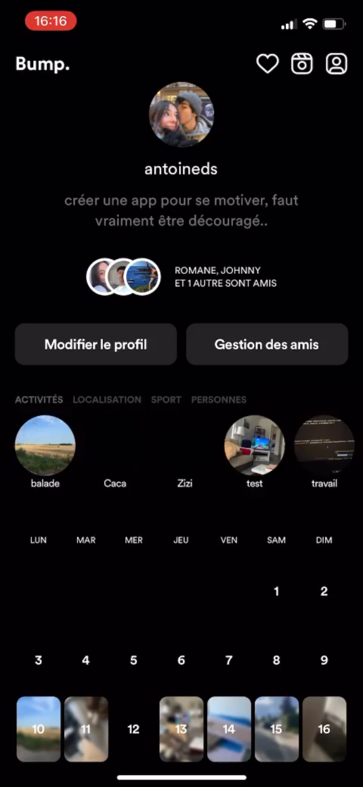

# Bump - Motivation à travers le partage de photos avec vos amis

Bienvenue sur Bump, une application conçue pour vous motiver à travers le partage de photos avec vos amis. Bump utilise les fonctionnalités de votre téléphone telles que la récupération de la localisation et le suivi des pas pour créer une expérience motivante unique adaptée à vos activités quotidiennes.

## Fonctionnalités principales

- **Partage de photos :** Partagez des photos avec vos amis pour vous inspirer et vous motiver mutuellement dans vos parcours.

- **Intégration de la localisation :** Bump utilise les services de localisation de votre appareil pour fournir du contenu motivant contextuel basé sur votre environnement.

- **Suivi des pas :** Suivez vos pas quotidiens et lancez des défis à vos amis pour rester actifs ensemble.

## Technologie utilisée

- **Frontend :** Le frontend de Bump est construit avec [Expo](https://expo.dev/) et React Native pour offrir une expérience fluide et cross-platform.

- **Backend :** Le backend de Bump est alimenté par [Pocketbase](https://pocketbase.io/), une solution de base de données NoSQL, pour une gestion efficace des données et une évolutivité optimale.

## Développement

Le développement de Bump a pris environ 10-20 jours, en mettant l'accent à la fois sur la conception frontend et l'intégration backend. En exploitant les capacités de Pocketbase, nous avons intégré des fonctionnalités telles que la récupération de la localisation et le suivi des pas pour améliorer l'expérience utilisateur.

## Captures d'écran

Tout les screens ont été pris pendant la phase de developement, le nom de l'appli a changé depuis :)

  
  
  
  

